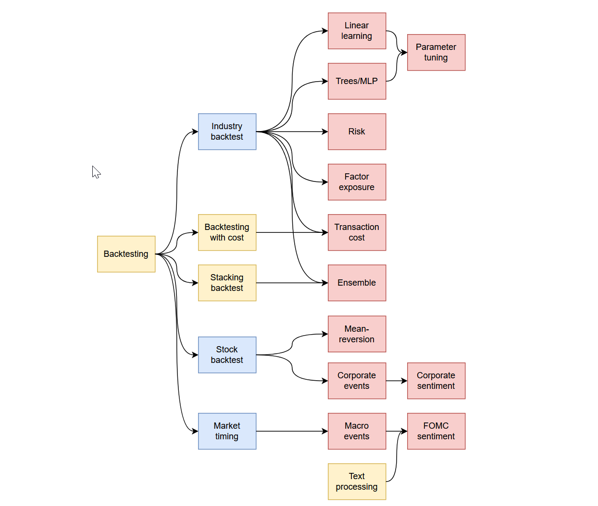

<!-- #region -->
# skfin
Machine learning for portfolio management and trading with scikit-learn

## Motivation

This repo contains a set of python notebooks that cover topics related to machine-learning for portfolio management as illustrated by the figure below.

<div align="left"></div>

The concatenation of all notebooks as a single pdf file can be found [here](./book/skfin.pdf).

## Example 

An example to run a simple backtest with learning using a `Ridge` estimator: 

```python 
from skfin import Backtester, MeanVariance, Ridge
from skfin.datasets import load_kf_returns
from skfin.plot import line
from sklearn.pipeline import make_pipeline
from sklearn.preprocessing import StandardScaler

estimator = make_pipeline(StandardScaler(with_mean=False), Ridge(), MeanVariance())

returns_data = load_kf_returns(cache_dir="data")
ret = returns_data["Monthly"]["Average_Value_Weighted_Returns"][:"1999"]

transform_X = lambda x: x.rolling(12).mean().fillna(0)
transform_y = lambda x: x.shift(-1)
features = transform_X(ret)
target = transform_y(ret)

pnl_ = Backtester(estimator).train(features, target, ret)
line(pnl_, cumsum=True, title="Ridge")
```

## Installation
```
git clone https://github.com/schampon/skfin.git 
cd skfin
./create_env.sh
```
<!-- #endregion -->

```python

```
